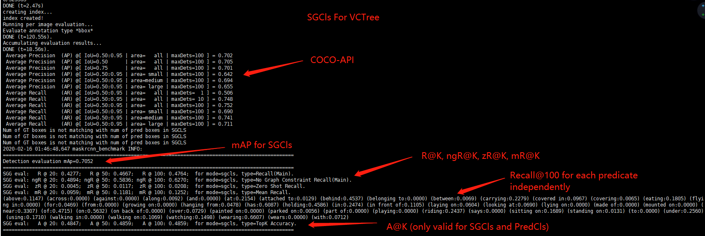

# Explanation of our metrics
### Recall@K (R@K)
The earliest and the most widely accepted metric in scene graph generation, which is firstly adopted by [Visual relationship detection with language priors](https://arxiv.org/abs/1608.00187). Since the ground-truth annotations of relationships are incomplete, it's improper to use simple accurary as the metric. Therefore, Lu et al. transfer it to a retrieve-like problem: the relationships are not only required to be correctly classified, but also required to have as higher score as possible, so they can be retrieved from plenty of 'none' relationship pairs.

### No Graph Constraint Recall@K (ng-R@K)
It's firstly used by [Pixel2Graph](https://arxiv.org/abs/1706.07365) and named by [Neural-MOTIFS](https://arxiv.org/abs/1711.06640). The former paper significantly improves the R@K results by allowing each pair to have multiple predicates, which means for each subject-object pair, all the 50 predicates will be involved in the recall ranking not just the one with highest score. Since predicates are not exclusive, 'on' and 'riding' can both be correct. This setting significantly improves the R@K. To fairly compare with other methods, [Neural-MOTIFS](https://arxiv.org/abs/1711.06640) named it as the No Graph Constraint Recall@K (ngR@K).

### Mean Recall@K (mR@K)
It is proposed by our work [VCTree](https://arxiv.org/abs/1812.01880) and Chen et al.s'[KERN](https://arxiv.org/abs/1903.03326) at the same time (CVPR 2019), although we didn't make it as our main contribution and only listed the full results on the [supplementary material](https://zpascal.net/cvpr2019/Tang_Learning_to_Compose_CVPR_2019_supplemental.pdf). However, we also acknowledge the contribution of [KERN](https://arxiv.org/abs/1903.03326), for they gave more mR@K results of previous methods. The main motivation of Mean Recall@K (mR@K) is that the VisualGenome dataset is biased towards dominant predicates. If the 10 most frequent predicates are correctly classified, the accuracy would reach 90% even the rest 40 kinds of predicates are all wrong. This is definitely not what we want. Therefore, Mean Recall@K (mR@K) calculates Recall@K for each predicate category independently then report their mean. 

### No Graph Constraint Mean Recall@K (ng-mR@K)
The same mean Recall metric, but for each pair of objects, all possible predicates are valid candidates (the original mean Recall@K only considers the predicate with maximum score of each pair as the valid candidate to calculate Recall).

### Zero Shot Recall@K (zR@K)
It is firstly used by [Visual relationship detection with language priors](https://arxiv.org/abs/1608.00187) for VRD dataset, and firstly reported by  [Unbiased Scene Graph Generation from Biased Training](https://arxiv.org/abs/2002.11949) for VisualGenome dataset. In short, it only calculates the Recall@K for those subject-predicate-object combinations that not occurred in the training set.

### No Graph Constraint Zero Shot Recall@K (ng-zR@K)
The same zero-shot Recall metric, but for each pair of objects, all possible predicates are valid candidates (the original zero-shot Recall@K only considers the predicate with maximum score of each pair as the valid candidate to calculate Recall).

### Top@K Accuracy (A@K) 
It is actually caused by the misunderstanding of PredCls and SGCls protocols. [Contrastive Losses](https://arxiv.org/abs/1903.02728) reported Recall@K of PredCls and SGCls by not just giving ground-truth bounding boxes, but also giving the ground-truth subject-object pairs, so no ranking is involved. The results can only be considerred as Top@K Accuracy (A@K) for the given K ground-truth subject-object pairs. 

### Sentence-to-Graph Retrieval (S2G)
S2G is proposed by [Unbiased Scene Graph Generation from Biased Training](https://arxiv.org/abs/2002.11949) as an ideal downstream task that only relies on the quality of SGs, for the existing VQA and Captioning are too complicated and challenged by their own bias. It takes human descriptions as queries, searching for matching scene graphs (images), where SGs are considered as the symbolic representations of images. More details will be explained in [S2G-RETRIEVAL.md](maskrcnn_benchmark/image_retrieval/S2G-RETRIEVAL.md).

# Two Common Misunderstandings in SGG Metrics
When you read/follow a SGG paper, and you find that its performance is abnormally high for no obvious reasons, whose authors could mess up some metrics.

1. Not differentiate Graph Constraint Recall@K and No Graph Constraint Recall@K. The setting of With/Without Constraint is introduced by [Neural-MOTIFS](https://arxiv.org/abs/1711.06640). However, some early work and a few recent researchers don't differentiate these two setting, using No Graph Constraint results to compare with previous work With Graph Constraint. TYPICAL SYMPTOMS: 1) Recall@100 of PredCls is larger than 75%, 2) not mention With/Without Graph Constraint in the original paper. TYPICAL Paper:[Pixel2Graph](https://arxiv.org/abs/1706.07365) (Since this paper is published before MOTIFS, they didn't mean to take this advantage, and they are actually the fathers of No Graph Constraint setting while MOTIFS is the one who named this baby.)

2. Some researchers misunderstand the protocols of PredCls and SGCls. These two protocols only give ground-truth bounding boxes NOT ground-truth subject object pairs. Some works only predict relationships for ground-truth subject-object pairs in PredCls and SGCls, so their PredCls and SGCls results will extremely high. Note that Recall@K metric is a ranking metric, using ground-truth subject-object pairs can be considerred as giving the perfect ranking. In order to separate from normal PredCls and SGCls,  I name this kind of setting as Top@K Accuracy, which is only applicable to PredCls and SGCls. TYPICAL SYMPTOMS: 1) results of PredCls and SGCls are extremely high while results of SGGen are normal, 2) Recall@50 and Recall@100 of PredCls and SGCls are exactly the same, since the ranking is perfect (Recall@20 is less, for some images have groud-truth relationships more than 20). TYPICAL Paper:[Contrastive Losses](https://arxiv.org/abs/1903.02728).

# Output Format of Our Code

