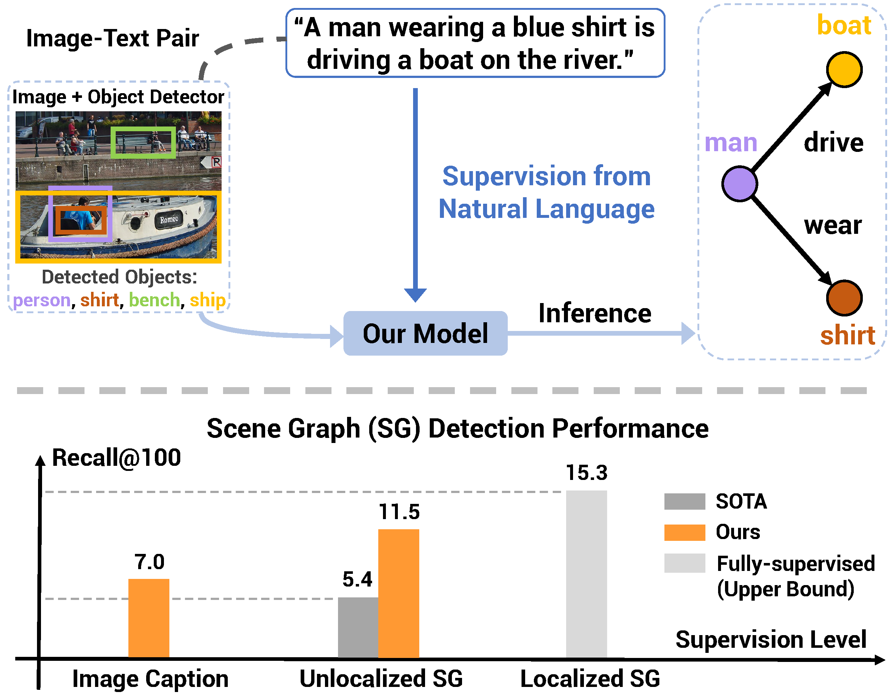
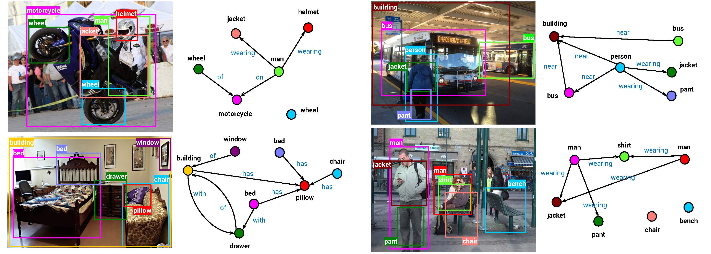
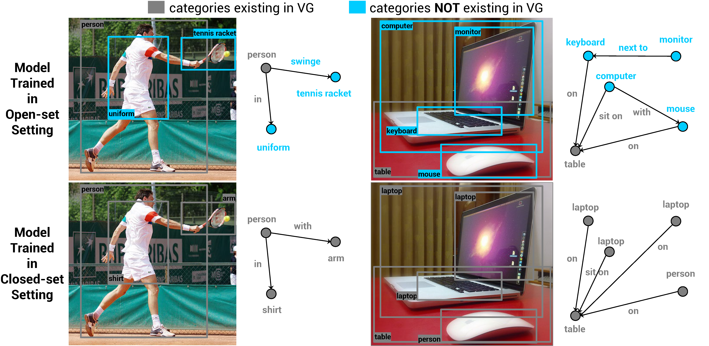

# Scene Graph Generation from Natural Language Supervision
This repository includes the Pytorch code for our paper "[Learning to Generate Scene Graph from Natural Language Supervision](https://arxiv.org/abs/2109.02227)" accepted in ICCV 2021.

<p align="center">
  
</p>
Top (our setting): Our goal is learning to generate localized scene graphs from image-text pairs. Once trained, our model takes an image and its detected objects as inputs and outputs the image scene graph. Bottom (our results): A comparison of results from our method and state-of-the-art (SOTA) with varying levels of supervision.


## Contents

1. [Overview](#Overview)
2. [Qualitative Results](#Qualitative-Results)
3. [Installation](#Installation)
4. [Data](#Data)
5. [Metrics](#Metrics)
6. [Pretrained Object Detector](#Pretrained-Object-Detector)
7. [Pretrained Scene Graph Generation Models](#Pretrained-Scene-Graph-Generation-Models)
8. [Model Training](#Model-Training)
9. [Model Evaluation](#Model-Evaluation)
10. [Acknowledgement](#Acknowledgement)
11. [Reference](#Reference)

## Overview

Learning from image-text data has demonstrated recent success for many recognition tasks, yet is currently limited to visual features or individual visual concepts such as objects. In this paper, we propose one of the first methods that learn from image-sentence pairs to extract a graphical representation of localized objects and their relationships within an image, known as scene graph. To bridge the gap between images and texts, we leverage an off-the-shelf object detector to identify and localize object instances, match labels of detected regions to concepts parsed from captions, and thus create "pseudo" labels for learning scene graph. Further, we design a Transformer-based model to predict these "pseudo" labels via a masked token prediction task. Learning from only image-sentence pairs, our model achieves 30\% relative gain over a latest method trained with human-annotated unlocalized scene graphs. Our model also shows strong results for weakly and fully supervised scene graph generation. In addition, we explore an open-vocabulary setting for detecting scene graphs, and present the first result for open-set scene graph generation.

## Qualitative Results
### Our generated scene graphs learned from image descriptions
<p align="center">
  
</p>
Partial visualization of Figure 3 in our paper: Our model trained by image-sentence pairs produces scene graphs with a high quality (e.g. "man-on-motorcycle" and "man-wearing-helmet" in first example). More comparison with other models trained by stronger supervision (e.g. unlocalized scene graph labels, localized scene graph labels) can be viewed in the Figure 3 of paper.

### Our generated scene graphs in open-set and closed-set settings
<p align="center">
  
</p>
Figure 4 in our paper: We explored open-set setting where the categories of target concepts (objects and predicates) are unknown during training. Compared to our closed-set model, our open-set model detects more concepts outside the evaluation dataset, Visual Genome (e.g. "swinge", "mouse", "keyboard"). Our results suggest an exciting avenue of large-scale training of open-set scene graph generation using image captioning dataset such as Conceptual Caption.


## Installation

Check [INSTALL.md](INSTALL.md) for installation instructions.

## Data

Check [DATASET.md](DATASET.md) for instructions of data downloading.

## Metrics

Explanation of metrics in this toolkit are given in [METRICS.md](METRICS.md)

## Pretrained Object Detector

In this project, we primarily use the detector Faster RCNN pretrained on Open Images dataset. To use this repo, you don't need to run this detector. You can directly download the extracted detection features, as the instruction in [DATASET.md](DATASET.md). 

If you're interested in this detector, the pretrained model can be found in [TensorFlow 1 Detection Model Zoo: faster_rcnn_inception_resnet_v2_atrous_oidv4](https://github.com/tensorflow/models/blob/master/research/object_detection/g3doc/tf1_detection_zoo.md#open-images-trained-models). 

**Update**: The script used to extract region features (TensorFlow 1 Detection Model) is uploaded in [preprocess/README.md](https://github.com/YiwuZhong/SGG_from_NLS/tree/main/preprocess).

Additionally, to compare with previous fully supervised models, we also use the detector pretrained by [Scene-Graph-Benchmark](https://github.com/KaihuaTang/Scene-Graph-Benchmark.pytorch#pretrained-models). You can download this [Faster R-CNN model](https://onedrive.live.com/embed?cid=22376FFAD72C4B64&resid=22376FFAD72C4B64%21779870&authkey=AH5CPVb9g5E67iQ) and extract all the files to the directory `checkpoints/pretrained_faster_rcnn`.

## Pretrained Scene Graph Generation Models

Our pretrained SGG models can be downloaded on [Google Drive](https://drive.google.com/drive/folders/1DioWZnht4eNfpm-LSWAqogYLuf-R2Qx8?usp=sharing). The details of these models can be found in Model Training section below. After downloading, please put all the folders to the directory `checkpoints/`. More pretrained models will be released. Stay tuned!

## Model Training

To train our scene graph generation models, run the script
```
bash train.sh MODEL_TYPE
```
where `MODEL_TYPE` specifies the training supervision, the training dataset and the scene graph generation model. See details below.

1. Language supervised models: trained by image-text pairs
    * `Language_CC-COCO_Uniter`: train our Transformer-based model on Conceptual Caption (CC) and COCO Caption (COCO) datasets
    * `Language_*_Uniter`: train our Transformer-based model on single dataset. `*` represents the dataset name and can be `CC`, `COCO`, and `VG`
    * `Language_OpensetCOCO_Uniter`: train our Transformer-based model on COCO dataset in open-set setting
    * `Language_CC-COCO_MotifNet`: train Motif-Net model with language supervision from CC and COCO datasets

2. Weakly supervised models: trained by unlocalized scene graph labels
    * `Weakly_Uniter`: train our Transformer-based model

3. Fully supervised models: trained by localized scene graph labels
    * `Sup_Uniter`: train our Transformer-based model
    * `Sup_OnlineDetector_Uniter`: train our Transformer-based model by using the object detector from [Scene-Graph-Benchmark](https://github.com/KaihuaTang/Scene-Graph-Benchmark.pytorch#pretrained-models). 

You can set `CUDA_VISIBLE_DEVICES` in `train.sh` to specify which GPUs are used for model training (e.g., the default script uses 2 GPUs).

## Model Evaluation

To evaluate the trained scene graph generation model, you can reuse the commands in `train.sh` by simply changing `WSVL.SKIP_TRAIN` to `True` and setting `OUTPUT_DIR` as the path to your trained model. One example can be found in `test.sh` and just run `bash test.sh`.

## Acknowledgement

This repository was built based on [Scene-Graph-Benchmark](https://github.com/KaihuaTang/Scene-Graph-Benchmark.pytorch) for scene graph generation and [UNITER](https://github.com/ChenRocks/UNITER) for image-text representation learning.

We specially would like to thank [Pengchuan Zhang](https://scholar.google.com/citations?user=3VZ_E64AAAAJ&hl=en) for providing the object detector pretrained on Objects365 dataset which was used in our ablation study.

## Reference
If you are using our code, please consider citing our paper.
```
@inproceedings{zhong2021SGGfromNLS,
  title={Learning to Generate Scene Graph from Natural Language Supervision},
  author={Zhong, Yiwu and Shi, Jing and Yang, Jianwei and Xu, Chenliang and Li, Yin},
  booktitle={ICCV},
  year={2021}
}
```
